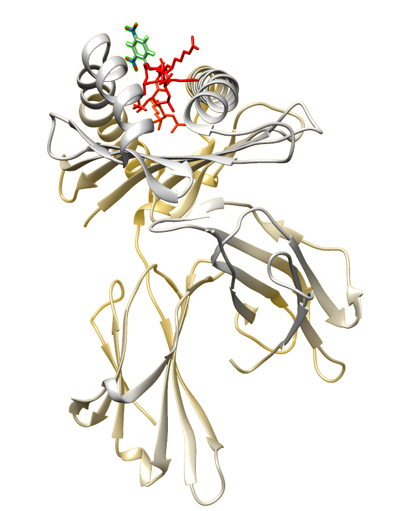
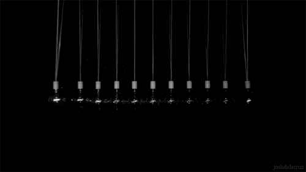
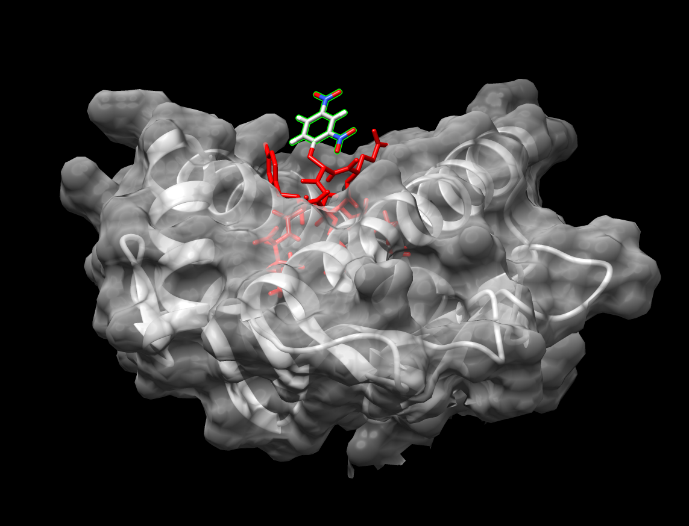
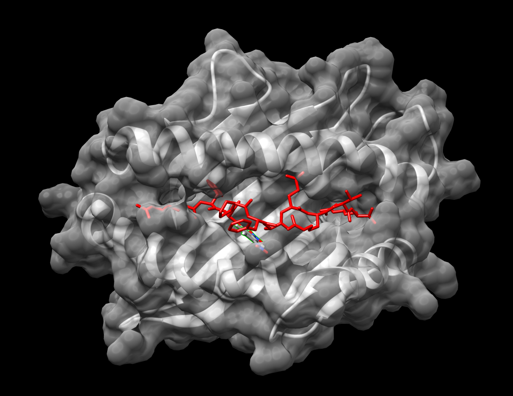
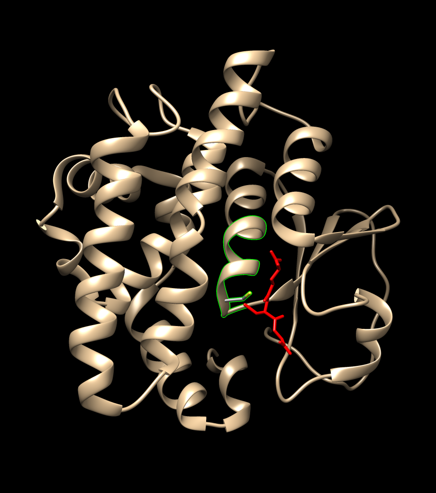
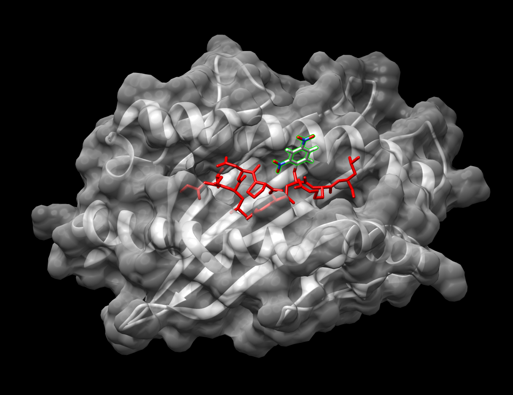
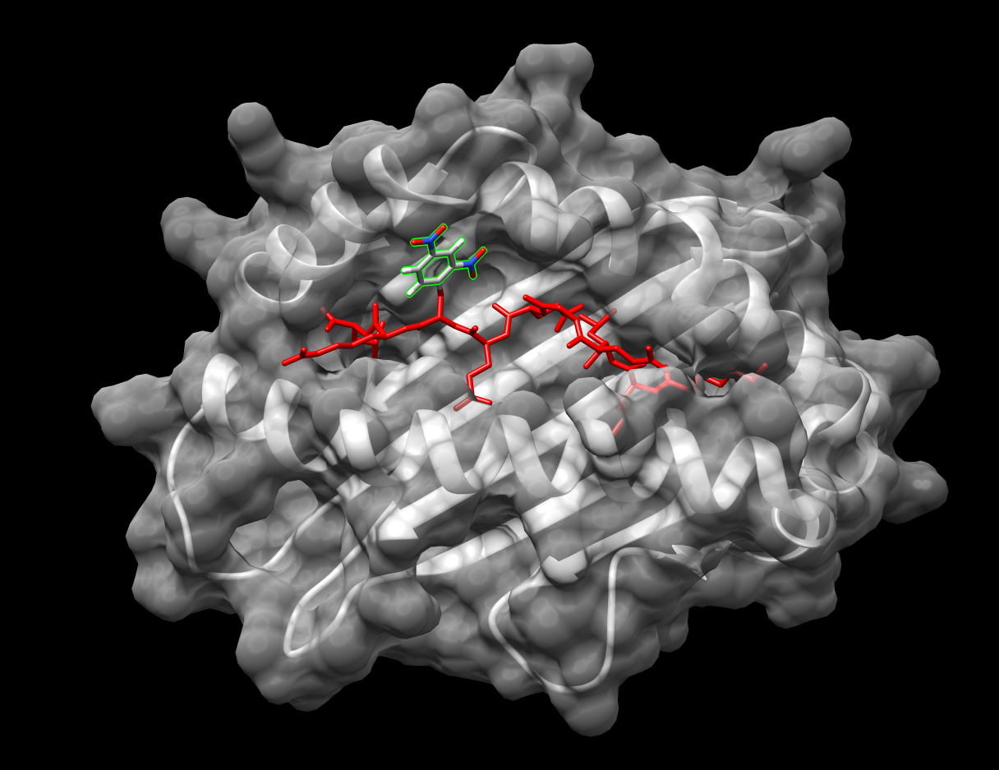

```{r setup, include=FALSE}
options(htmltools.dir.version = FALSE)
library(tidyverse)
library(UpSetR)
library(ggseqlogo)

# Load HaCaT data
dat <- readRDS("data/wt-dat.RDS")

dat_sub <- dat %>% select(peptide,length,exp_name,accession) %>%
  filter(length >= 8 & length <= 15, str_detect(accession,"HUMAN")) %>%
  mutate(exp_type = if_else(str_detect(exp_name,"^C"),
                                         "Control","DNCB"),
         peptide = str_replace_all(peptide,"\\(.*?\\)", ""))

#Transfectant data
a2_dat <- read_rds("data/a2_dat.RDS") %>%
  select(peptide,length,exp_name,accession) %>%
  filter(length >= 8 & length <= 15, str_detect(accession,"HUMAN")) %>%
  mutate(exp_type = if_else(str_detect(exp_name,"^C"),
                                         "Control","DNCB"),
         peptide = str_replace_all(peptide,"\\(.*?\\)", ""))

a2_dncb_mods <- read_rds("data/a2_dncb_mods.RDS")

wt_logos <- read_rds("data/hacat-wt-pred-logos-dat.rds")
iedb_wt_logos <- read_rds("data/ideb-wt-logos-dat.rds")
ideb_a2_logos <- read_rds("data/iedb-logos-A2.rds")
a2_logos <- read_rds("data/hacat-A2-pred-logos.rds")
bind_plot <- read_rds("data/hacat_wt_pred_binders_plot.RDS")
a2_bind_plot <- read_rds("data/hacat_pred_binders_plot.RDS")

glut_sub <- read_rds("data/glut_sub.RDS")
ker_sub <- read_rds("data/ker_sub.RDS")

rini_df <- read_rds("data/rini_df.RDS")
ker_df <- read_rds("data/ker_df.RDS")

cell_viability <- read_rds("data/cell-viability-output-20-12-2018.rds")
# Marine-1, Horizon-1, Horizon-3, Marine-2, Horizon-2
my_cols <- c("#005C84","#FCBC00","#E73037","#74C9E5","#EF7D00")

facs_dat <- read_rds("data/hacat-facs-05-03-2019.rds")
proto_example <- read_rds("data/prot-turnover-example.rds")
proto_gst <- read_rds("data/prot-turnover-gst.rds")
```

class: center,middle

```{r summary-table,echo=FALSE}
htmltools::includeHTML("data/immunosense-summary-table-01-03-2019.html")
```

---

class: split-two 

.column.inverse[.content.center.vmiddle[

# Hypothesis

.horizon-1.bold[DNCB] (2,4-Dinitrochlorobenzene) and .horizon-1.bold[DPCP] (Diphenylcyclopropenone)
modified peptides stimulate CD8<sup>+</sup> T-cells

]]

.column.horizon-1-slide[.content.middle.center[

```{r,out.width="85%",echo=FALSE, cache=FALSE}

```
]]

---

class: split-two 

.column.inverse[.content.center.vmiddle[

# Hypothesis

.horizon-1.bold[DNCB] (2,4-Dinitrochlorobenzene) and .horizon-1.bold[DPCP] (Diphenylcyclopropenone)
modulate the peptidome

]]

.column.horizon-1-slide[.content.vmiddle.center[


]]

---

layout: false
class: split-33 
.column.inverse[.content.center.vmiddle[

## HaCaTs express MHC class I, but not MHC class II

]]

.column.horizon-1-slide[.content.center.vmiddle[

```{r facs-data,echo=FALSE,fig.retina=6,fig.asp=0.8,out.width="90%",cache=FALSE,warning=FALSE}
# Plot facs data
facs_dat %>% ggplot(aes(Condtion,sMFI_n, fill = fct_reorder2(Antibody,Condtion,sMFI_n))) +
  geom_bar(stat = "identity", position = "dodge2") +
  facet_wrap(~ Cell) +
  ylab("Specific Mean Fluorscence Intensity") +
  labs(fill = "Antibody") +
  scale_fill_manual(values = my_cols[c(1:3)]) +
  theme_minimal(base_size = 14)
```


]]

.remark-slide-number {display: none;}

---

layout: false
class: split-33 

.column.inverse[.content.center.vmiddle[

# At what concentration are DNCB and DPCP toxic?

]]

.column.horizon-1-slide[.content.center.vmiddle[

```{r cell-viability,echo=FALSE,fig.retina=6,fig.asp=0.8,out.width="90%",cache=FALSE,warning=FALSE}
cell_viability %>% 
  ggplot(aes(conc,max, colour = assay)) + 
  geom_point() +
  geom_line() +
  geom_errorbar(aes(ymin=max-se, ymax=max+se), width=.1) +
  scale_x_log10() +
  annotate("segment", x = 5, xend = 5, y = 0, yend = 220,
  colour = "black",linetype = 3) +
  annotate("text", x = 2.8, y = 32, label = expression(5~mu*M)) +
  xlab(label = expression(Concentration~mu*M)) +
  ylab("Percent") +
  ylim(-10,220) +
  scale_colour_manual(values = my_cols[c(1,3)]) +
  theme_minimal(base_size = 14) +
  theme(panel.spacing = unit(2, "lines")) +
   facet_wrap(treatment ~ cell)
```

]]

---


class: inverse
background-image: url(img/hacat-a2-04-01-2019.jpg)
background-size: 100%

# .content.black.bold[Wildtype HaCaT cells]

---

layout: false
class: split-two 

.column.inverse[.content.center.vmiddle[

Number of peptide N-mers, n = 6

```{r wt-histograms-1, fig.retina=4,echo=FALSE, cache=FALSE}
dat_sub %>% 
  select(length, exp_type, exp_name) %>% 
  group_by(length, exp_name) %>% 
  mutate(n_peps = n()) %>% 
  ungroup() %>% 
  distinct() %>% 
  group_by(length,exp_type) %>% 
  summarise(mean_peps = mean(n_peps), sqn = sqrt(n()),  sem = sd(n_peps)/sqn) %>%
  ggplot(aes(x = length, y = mean_peps,fill = exp_type)) +
  geom_bar(stat='identity') +
  geom_errorbar(aes(ymin=mean_peps-sem, ymax=mean_peps+sem),
                width=.2) +
  scale_x_continuous(breaks=seq(8, 15, 1)) +
  theme_minimal(base_size = 16) +
  theme(legend.position = "") +
  xlab("Peptide length") +
  ylab("Number of peptides") +
  #scale_fill_brewer(palette="Set1") +
  scale_fill_manual(values = my_cols[c(1,3)]) +
  facet_wrap(~ exp_type)
```

]]

.column.inverse[.content.center.vmiddle[

Percentage of peptide N-mers, n = 6

```{r wt-histograms-2, fig.retina=4, echo=FALSE, cache=FALSE}
dat_sub %>% 
  select(length, exp_type, exp_name) %>% 
  group_by(exp_name, length) %>% 
  summarise(n = n()) %>% 
  mutate(f_peps = n/sum(n), 
         exp_type = if_else(str_detect(exp_name,"^C"), 
                                         "Control","DNCB")) %>% 
  ungroup() %>%
  distinct() %>% 
  group_by(exp_type,length) %>% 
  summarise(mean_peps = mean(f_peps), sqn = sqrt(n()),  sem = sd(f_peps)/sqn) %>%
  ggplot(aes(x = length, y = mean_peps,fill = exp_type)) +
  geom_bar(stat='identity') +
  geom_errorbar(aes(ymin=mean_peps-sem, ymax=mean_peps+sem),
                width=.2) +
  scale_x_continuous(breaks=seq(8, 15, 1)) +
          scale_y_continuous(labels=scales::percent, limits = c(0,0.6)) +
  theme_minimal(base_size = 16) +
  theme(legend.position = "") +
  xlab("Peptide length") +
  ylab("Percentage of peptides") +
  #scale_fill_brewer(palette="Set1") +
  scale_fill_manual(values = my_cols[c(1,3)]) +
  facet_wrap(~ exp_type)
```

]]

---

class: split-two 

.column.inverse[.content.center.vmiddle[

Intersection between all peptides

```{r, upset-plot,fig.retina=4, fig.asp=0.8,out.width="100%", echo=FALSE, cache=FALSE}

du <- dat_sub %>% 
  select(peptide, exp_type) %>% 
  group_by(exp_type,peptide) %>% 
  distinct() %>% 
  tally() %>% 
  mutate(n = as.integer(n)) %>% 
  spread(exp_type,n, fill = 0) %>%
  mutate(peptide = as.factor(peptide))

upset(as.data.frame(du), nsets = 2,  
      number.angles = 0, point.size = 5, 
      line.size = 2,order.by = "freq", 
      main.bar.color = my_cols[1], 
      matrix.color = my_cols[2], 
      sets.bar.color = my_cols[c(1,3)],
      mainbar.y.label = "Peptide Intersections", sets.x.label = "Number of Peptides",
      #c(intersection size title, intersection size tick labels, set size title, set size tick labels, set names, numbers above bars)
      text.scale = c(1.6, 1.6, 1.6, 1, 1.6, 2))
```

]]

.column.horizon-1-slide[.content.center.vmiddle[

Intersection of 9-mers

```{r, upset-2,upset-plot,fig.retina=4,fig.asp=0.8,out.width="100%", echo=FALSE, cache=FALSE}
du2 <- dat_sub %>% 
  filter(length == 9) %>% 
  select(peptide, exp_type) %>% 
  group_by(exp_type,peptide) %>% 
  distinct() %>% 
  tally() %>% 
  mutate(n = as.integer(n)) %>% 
  spread(exp_type,n, fill = 0) %>%
  mutate(peptide = as.factor(peptide))

upset(as.data.frame(du2), nsets = 2,  
      number.angles = 0, point.size = 5, 
      line.size = 2,order.by = "freq", 
      matrix.color = my_cols[2], 
      main.bar.color = my_cols[1], 
      sets.bar.color = my_cols[c(1,3)],
      mainbar.y.label = "Peptide Intersections", sets.x.label = "Number of Peptides", 
      #c(intersection size title, intersection size tick labels, set size title, set size tick labels, set names, numbers above bars)
      text.scale = c(1.6, 1.6, 1.6, 1, 1.6, 2))
```

]]

---

class: split-two

.column.inverse[.content.center.vmiddle[

Immune epitope database peptides

```{r, iedb-logos, fig.retina=4, echo=FALSE,fig.asp=0.8,out.width="100%",message=F, cache=FALSE}
# IEDB logos
ggseqlogo(iedb_wt_logos)
```

]]

.column.horizon-1-slide[.content.center.vmiddle[

Peptide classification model

```{r, wt_logos,fig.retina=4,fig.asp=0.8,out.width="100%", echo=FALSE, cache=FALSE}
ggseqlogo(wt_logos)
```

]]

???

There were 1000 9-mer peptides for each allotype for the IEDB peptides

---
class: inverse

```{r, wt_preds,fig.retina=6,echo=FALSE,fig.asp=0.6,out.width="100%", cache=FALSE}
bind_plot + scale_fill_gradient(low = my_cols[5], high = my_cols[1]) +
  labs(title = "Identified NetMHC binding predicted 9-mer peptides ",
      subtitle = "Predicted binders in blue") 
```

---

class: split-two

.column.inverse[.content.center.vmiddle[

## DNCB modified peptides

HLA-B*40:01, 9mer, .horizon-1.bold[AETEC(+DNP)RYAL], <br> Keratin type I cytoskeletal 13

HLA-A*31:01, 10mer, .horizon-1.bold[RFC(+DNP)PFAERTR], Glutathione S-transferase omega-1 

]]

.column.horizon-1-slide[.content.center.vmiddle[

```{r dncb-mods-table, out.width="100%",echo=FALSE, cache=FALSE}
# Find DNCB modifications
DT::datatable(dat %>% 
               filter(str_detect(peptide,"\\+166"), length >= 8 & length <= 15) %>% 
  select(peptide,scan,exp_name,length,accession) %>% 
  mutate(prot_id = (str_extract(accession,"(sp\\|)(.*?)(\\|)") %>% 
  str_replace_all(.,"[sp]|[\\|]|(-.{1})",""))) %>%
    filter(prot_id == "P13646" | prot_id == "P78417") %>% 
    arrange(peptide) %>% 
  select("Peptide" = peptide, 
         "Replicate" = exp_name), 
  rownames = FALSE, options = list(dom = 't'))
```

]]
---

class: split-two

.column.inverse[.content.center.vmiddle[

HLA-B*40:01, 9mer, .horizon-1.bold[AETEC(+DNP)RYAL] <br> Keratin type I cytoskeletal 13


```{r kera-scan,warning=FALSE, echo=FALSE,fig.retina=4,fig.asp=0.7,out.width="100%", cache=FALSE}
ker_sub %>% ggplot(aes(x = mz,y = intensity)) + 
  geom_bar(stat="identity", width = 0.001) +
  #geom_density(stat="identity") +
  xlim(c(611.15,613)) +
  theme_minimal() +
  xlab("mass/charge") +
  ylab("Intensity") +
  annotate("text", x = 611.41, y = 900000 , label = "611.25, DNCB", size=3) +
  annotate("text", x = 612.55, y = 700000 , label = "612.75, DNCB-D3", size=3) +
  #ggtitle("HLA-B*40:01, 9mer, AETEC(+DNP)RYAL", 
  #        subtitle = "Keratin, type I cytoskeletal 13") +
  scale_fill_manual(values = my_cols) +
  scale_y_continuous(labels = function(x) format(x, scientific = TRUE)) +
  facet_wrap(~exp_name, nrow =4)
```

.tiny[Doubly charged peptide: DNCB-D<sub>3</sub> is 3 mass units heavier, divided by 2 charges = 1.5 Da mass difference]

]]

.column.horizon-1-slide[.content.center.vmiddle[

HLA-A*31:01, 10mer, .white.bold[RFC(+DNP)PFAERTR] <br> Glutathione S-transferase omega-1

```{r glut-scan,warning=FALSE, echo=FALSE,fig.retina=4,fig.asp=0.7,out.width="100%", cache=FALSE}
glut_sub %>% ggplot(aes(x = mz,y = intensity)) + 
  geom_bar(stat="identity", width = 0.001) +
  xlim(c(483.5,485)) +
  xlab("mass/charge") +
  ylab("Intensity") +
  annotate("text", x = 483.68, y = 600000 , label = "483.55, DNCB", size=3) +
  annotate("text", x = 484.71, y = 500000 , label = "484.55, DNCB-D3",size=3 ) +
  theme_minimal() +
  #ggtitle("HLA-B*40:01, 9mer, AETEC(+DNP)RYAL", 
  #        subtitle = "Keratin, type I cytoskeletal 13") +
  scale_fill_manual(values = my_cols) +
  scale_y_continuous(labels = function(x) format(x, scientific = TRUE)) +
  facet_wrap(~exp_name, nrow =3)
```

.tiny[Triply charged peptide: DNCB-D<sub>3</sub> is 3 mass units heavier, divided by 3 charges = 1 Da mass difference]

]]

---

class: split-three

.column.inverse[.content.center.vmiddle[

HLA-B\*40:01 9-mer, AETEC(+DNP)RYAL <br> .small[Keratin, type I cytoskeletal 13]

```{r keratin-mhc, echo=FALSE,cache=FALSE}

```

]]

.column.horizon-1-slide[.content.center.vmiddle[

HLA-A\*31:01, 10-mer RFC(+DNP)PFAERTR <br> .small[Glutathione S-transferase omega-1] 

```{r gst-mhc,echo=FALSE, cache=FALSE}

```

]]

.column.horizon-2-slide[.content.center.vmiddle[

.small[Glutathione S-transferase omega-1]

```{r gst, echo=FALSE, cache=FALSE}

```

]]

---

class: inverse
background-image: url(img/hacat-a2-04-01-2019.jpg)
background-size: 100%

# .content.black.bold[HaCaT HLA-A*02:01 <br> transfectant cells]

---

class: split-two 

.column.inverse[.content.center.vmiddle[

Number of peptide N-mers, n = 3

```{r, fig.retina=4,echo=FALSE, cache=FALSE}
a2_dat %>% 
  select(length, exp_type, exp_name) %>% 
  group_by(length, exp_name) %>% 
  mutate(n_peps = n()) %>% 
  ungroup() %>% 
  distinct() %>% 
  group_by(length,exp_type) %>% 
  summarise(mean_peps = mean(n_peps), sqn = sqrt(n()),  sem = sd(n_peps)/sqn) %>%
  ggplot(aes(x = length, y = mean_peps,fill = exp_type)) +
  geom_bar(stat='identity') +
  geom_errorbar(aes(ymin=mean_peps-sem, ymax=mean_peps+sem),
                width=.2) +
  scale_x_continuous(breaks=seq(8, 15, 1)) +
  theme_minimal(base_size = 16) +
  theme(legend.position = "") +
  xlab("Peptide length") +
  ylab("Number of peptides") +
  #scale_fill_brewer(palette="Set1") +
  scale_fill_manual(values = my_cols[c(1,3)]) +
  facet_wrap(~ exp_type)
```

]]

.column.inverse[.content.center.vmiddle[

Percentage of peptide N-mers, n = 3

```{r, fig.retina=4,echo=FALSE, cache=FALSE}
a2_dat %>% 
  select(length, exp_type, exp_name) %>% 
  group_by(exp_name, length) %>% 
  summarise(n = n()) %>% 
  mutate(f_peps = n/sum(n), 
         exp_type = if_else(str_detect(exp_name,"^C"), 
                                         "Control","DNCB")) %>% 
  ungroup() %>%
  distinct() %>% 
  group_by(exp_type,length) %>% 
  summarise(mean_peps = mean(f_peps), sqn = sqrt(n()),  sem = sd(f_peps)/sqn) %>%
  ggplot(aes(x = length, y = mean_peps,fill = exp_type)) +
  geom_bar(stat='identity') +
   geom_errorbar(aes(ymin=mean_peps-sem, ymax=mean_peps+sem),
                 width=.2) +
  scale_x_continuous(breaks=seq(8, 15, 1)) +
          scale_y_continuous(labels=scales::percent, limits = c(0,0.7)) +
  theme_minimal(base_size = 16) +
  theme(legend.position = "") +
  xlab("Peptide length") +
  ylab("Percentage of peptides") +
  #scale_fill_brewer(palette="Set1") +
  scale_fill_manual(values = my_cols[c(1,3)]) +
  facet_wrap(~ exp_type)
```

]]
---

class: split-two 

.column.inverse[.content.center.vmiddle[

Intersection between all peptides

```{r, upset-a2,fig.retina=4, fig.asp=0.8,out.width="100%", echo=FALSE, cache=FALSE}

du_a2 <- a2_dat %>% 
  select(peptide, exp_type) %>% 
  group_by(exp_type,peptide) %>% 
  distinct() %>% 
  tally() %>% 
  mutate(n = as.integer(n)) %>% 
  spread(exp_type,n, fill = 0) %>%
  mutate(peptide = as.factor(peptide))

upset(as.data.frame(du_a2), nsets = 2,  
      number.angles = 0, point.size = 5, 
      line.size = 2,order.by = "freq", 
      main.bar.color = my_cols[1], 
      matrix.color = my_cols[2], 
      sets.bar.color = my_cols[c(1,3)],
      mainbar.y.label = "Peptide Intersections", sets.x.label = "Number of Peptides",
      #c(intersection size title, intersection size tick labels, set size title, set size tick labels, set names, numbers above bars)
      text.scale = c(1.6, 1.6, 1.6, 1, 1.6, 2))
```

]]

.column.horizon-1-slide[.content.center.vmiddle[

Intersection of 9-mers

```{r, upset-2-a2,fig.retina=4,fig.asp=0.8,out.width="100%", echo=FALSE, cache=FALSE}
du2_a2 <- a2_dat %>% 
  filter(length == 9) %>% 
  select(peptide, exp_type) %>% 
  group_by(exp_type,peptide) %>% 
  distinct() %>% 
  tally() %>% 
  mutate(n = as.integer(n)) %>% 
  spread(exp_type,n, fill = 0) %>%
  mutate(peptide = as.factor(peptide))

upset(as.data.frame(du2_a2), nsets = 2,  
      number.angles = 0, point.size = 5, 
      line.size = 2,order.by = "freq", 
      matrix.color = my_cols[2], 
      main.bar.color = my_cols[1], 
      sets.bar.color = my_cols[c(1,3)],
      mainbar.y.label = "Peptide Intersections", sets.x.label = "Number of Peptides", 
      #c(intersection size title, intersection size tick labels, set size title, set size tick labels, set names, numbers above bars)
      text.scale = c(1.6, 1.6, 1.6, 1, 1.6, 2))
```

]]

---

class: split-two

.column.inverse[.content.center.vmiddle[

Immune epitope database peptides

```{r, iedb-a2-logos, fig.retina=4, echo=FALSE,fig.asp=0.8,out.width="100%",message=F, cache=FALSE}
# IEDB logos
ggseqlogo(ideb_a2_logos)
```

]]

.column.horizon-1-slide[.content.center.vmiddle[

Peptide classification model

```{r, a2_logos,fig.retina=4,fig.asp=0.8,out.width="100%", echo=FALSE, cache=FALSE}
ggseqlogo(a2_logos)
```

]]

???

There were 1000 9-mer peptides for each allotype for the IEDB peptides

---
class: inverse

```{r, a2_preds,fig.retina=6,echo=FALSE,fig.asp=0.6,out.width="100%", cache=FALSE}
a2_bind_plot + scale_fill_gradient(low = my_cols[5], high = my_cols[1]) +
  labs(title = "Identified NetMHC binding predicted 9-mer peptides ",
      subtitle = "Predicted binders in blue") 
```

---

class: split-two

.column.inverse[.content.center.vmiddle[

## DNCB modified peptides

HLA-A\*02:01 9-mer, .horizon-1.bold[GLLDPQC(+DNP)RL] <br> Ribonuclease inhibitor

HLA-A\*02:01 10-mer, .horizon-1.bold[KLLEGEEC(+DNP)RL] <br> Keratin, type II cytoskeletal 5

]]

.column.horizon-1-slide[.content.center.vmiddle[

```{r a2-dncb-mods-table, out.width="100%",echo=FALSE, cache=FALSE}
# Find DNCB modifications
DT::datatable(a2_dncb_mods %>% 
  select("Peptide" = peptide, 
         "Replicate" = exp_name) %>% 
    arrange(Peptide), 
  rownames = FALSE, options = list(dom = 't'))
```

]]
---

class: split-two

.column.inverse[.content.center.vmiddle[

HLA-A*02:01, 9-mer, .bold.horizon-1[GLLDPQC(+DNP)RL] <br> Ribonuclease inhibitor

```{r a2-rini-scan, warning=FALSE, echo=FALSE,fig.retina=4,fig.asp=0.7,out.width="100%", cache=FALSE}
rini_df %>% ggplot(aes(x = mz,y = intensity)) + 
  geom_bar(stat="identity", width = 0.001) +
  xlim(590,593) +
  #ylim(0,5e5) +
  theme_minimal() +
  xlab("mass/charge") +
  ylab("Intensity") +
  annotate("text", x = 590.45, y = 4e5 , label = "590.78, DNCB") +
  annotate("text", x = 591.9, y = 3e5 , label = "592.28, DNCB-D3" ) +
  scale_fill_manual(values = my_cols) +
  scale_y_continuous(labels = function(x) format(x, scientific = TRUE)) 
  # ggtitle("HLA-A*02:01, 9-mer, GLLDPQC(+DNP)RL", 
  #         subtitle = "Ribonuclease inhibitor") 
```

.tiny[Doubly charged peptide: DNCB-D<sub>3</sub> is 3 mass units heavier, divided by 2 charges = 1.5 Da mass difference]

]]

.column.horizon-1-slide[.content.center.vmiddle[

HLA-A*02:01, 10-mer, .bold.white[KLLEGEEC(+DNP)RL] <br> Keratin type II cytoskeletal 5

```{r a2-ker-scan, warning=FALSE, echo=FALSE,fig.retina=4,fig.asp=0.7,out.width="100%", cache=FALSE}
# Labels 
dat_text <- data.frame(
  label = c("454.05, DNCB-D3","453.55, DNCB-D3"),
  exp_name   = c("DNCB 2", "DNCB 3"))

ker_df %>% 
  ggplot(aes(x = mz,y = intensity)) + 
  geom_bar(stat="identity", width = 0.001) +
  xlim(452.0,454.5) +
  #ylim(0,2e5) +
  theme_minimal() +
  xlab("mass/charge") +
  ylab("Intensity") +
  annotate("text", x = 452.3, y = 15e4 , label = "452.55, DNCB") +
  geom_text(data    = dat_text,
  mapping = aes(x = c(453.75,453.05), y = c(15e4,15e4), label = label)) +
  scale_fill_manual(values = my_cols) +
  scale_y_continuous(labels = function(x) format(x, scientific = TRUE)) +
  # ggtitle("HLA-A*02:01, 10-mer, KLLEGEEC(+DNP)RL", 
  #         subtitle = "Keratin, type II cytoskeletal 5") +
  facet_wrap(~exp_name, nrow =2)
```

.tiny[Triply charged peptide: DNCB-D<sub>3</sub> is 3 mass units heavier, divided by 3 charges = 1 Da mass difference]

]]

---

class: split-two

.column.inverse[.content.center.vmiddle[

HLA-A\*02:01, 9-mer, GLLDPQC(+DNP)RL <br> .small[Ribonuclease inhibitor]

```{r rini, echo=FALSE,cache=FALSE}

```


]]

.column.horizon-1-slide[.content.center.vmiddle[

HLA-A\*02:01, 10-mer, KLLEGEEC(+DNP)RL <br> .small[Keratin, type II cytoskeletal 5] 

```{r kerr-II-mhc, echo=FALSE,cache=FALSE}

```

]]

---

class: inverse, middle, center

# Protein turnover

---

class: inverse

```{r example-turnover,fig.retina=4,fig.asp=0.6,out.width="100%", echo=FALSE, cache=FALSE}
proto_example %>% 
  ggplot(aes(time,ratio, colour = condition)) + 
  geom_line(aes(group = condition)) +
  geom_point(aes(group = condition)) +
  #scale_x_continuous(trans = "log1p") +
  facet_wrap(~treatment) +
  theme_minimal(base_size = 15) +
  #theme(legend.position = "") +
  xlab("Time (hours)") +
  ylab("Ratio") +
  #scale_fill_brewer(palette="Set1") +
  scale_color_manual(values = my_cols[c(1,3)]) +
  ggtitle("Fatty aldehyde dehydrogenase") +
  theme(legend.position="top", legend.title = element_blank())

```


---

layout: true
class: inverse with-border border-white

.column[
  .split-five[
  .row.bg-main1[.content[
# Recap 
  ]]
  .row.bg-main2[.content[
.horizon-1[No support for altered peptidome hypothesis yet:] <br>
The majority of the peptidome is observed $\pm$ sensitiser.
  ]]
  .row.bg-main3[.content[
.horizon-1[Support for the direct stimulation hypothesis:] <br>
Observation of sensitiser modified peptides.
  ]]
  .row.bg-main4[.content[
.horizon-1[Evidence for sensitiser effect on cellular detoxification mechanism:] <br>
Modification of Glutathione S-transferase omega-1.
  ]]
  .row.bg-main5[.content[
.horizon-1[Assessment of treatment toxicity HaCaTs:] <br> 
Peptidome repeats with DNCB and DPCP treatment at 5 $\mu$M
  ]]
]]

---

class: gray-row2-col1 gray-row3-col1 gray-row4-col1 gray-row5-col1
count: false

---

class: gray-row3-col1 gray-row4-col1 gray-row5-col1
count: false

---

class: gray-row4-col1 gray-row5-col1
count: false
---

class: gray-row5-col1
count: false

---

count: false
---